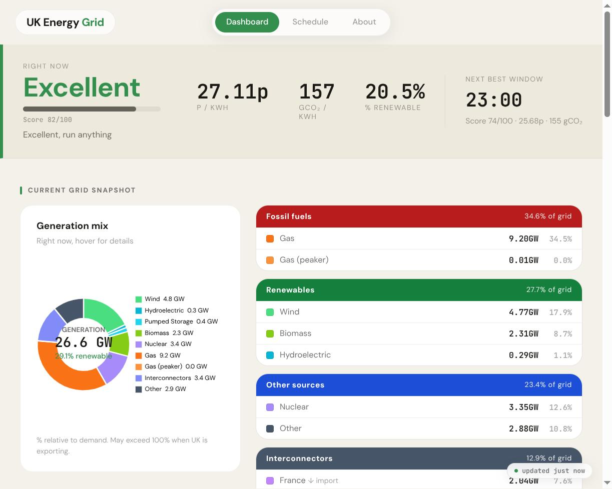
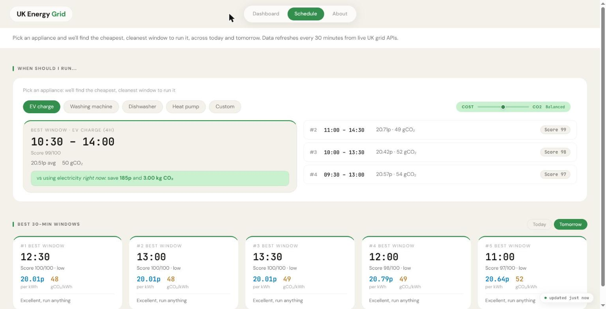
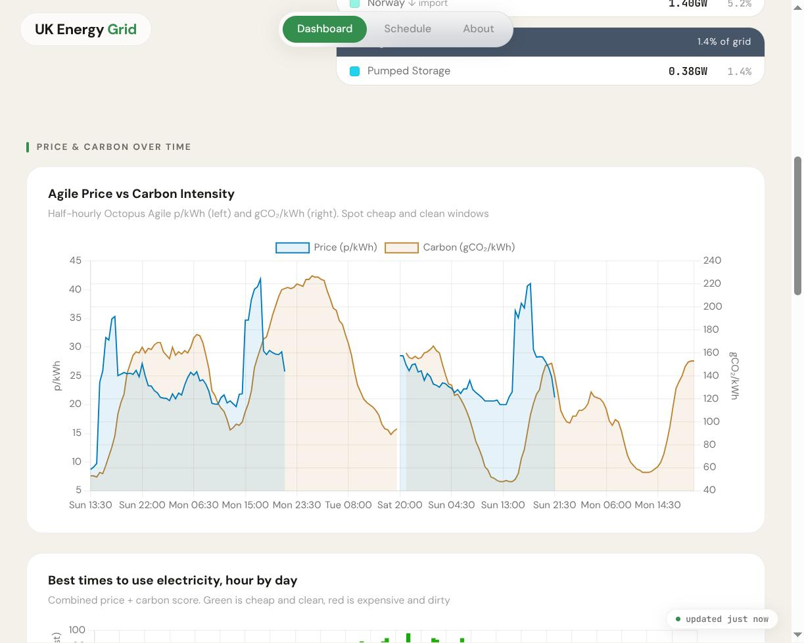
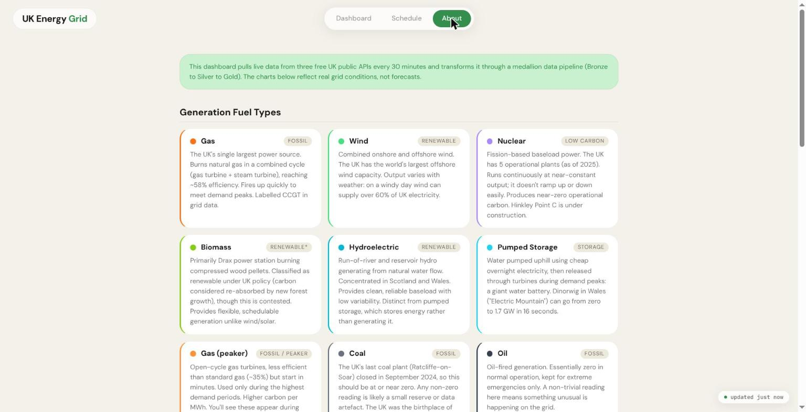

# UK Energy Grid Dashboard

A family friend of ours switched to Octopus Agile last winter, the tariff where the price of electricity changes every half hour depending on demand and what's on the grid. Great in theory. In practice it meant they kept ringing me up asking whether now was a good time to put the washing machine on, and I kept squinting at a spreadsheet to work it out. So I built this instead, mostly over a few weekends, and it rather got away from me.

It pulls live data from four free UK grid APIs, pushes it through a small dbt pipeline into DuckDB, and serves the whole thing as a FastAPI dashboard. No cloud services, no paid APIs, no separate database server to stand up. Python and one file on disk.

Could've gone with React and Postgres instead. Didn't, because someone who isn't me has to run this, and every extra moving part is one more thing I'd have to walk them through over the phone.

## What it does

The bit that actually gets used is the number at the top: a score from 0 to 100 for whether right now is a good time to use electricity, worked out from the live Agile price and the carbon intensity of the grid. Green and high is good. Red and low means wait twenty minutes.

Below that is an appliance planner. Pick EV charge, washing machine, dishwasher, heat pump, or set a custom duration, and it finds the cheapest and cleanest window in the next couple of days. There's also a plain list of the best five half-hour slots for today and tomorrow if you'd rather just look. A slider sits next to the appliance picker: drag it toward "Cost" or "CO2" and every window on the page re-ranks against whichever you care about more. It's a weighted blend of the two rankings, recomputed server-side across the full set of candidate windows on every request, not just whatever five happened to already be on screen (that was a bug for about a day, more on that below).

Then there's a pile of charts I added because the data was sitting there and it seemed a shame not to: live generation mix (wind, gas, nuclear, the interconnectors), price against carbon over time, an hour-of-day heatmap, carbon intensity by region, renewable share over the last month, solar and wind indices, temperature against demand. Some of these are more useful than others. I actually check the heatmap most weeks; the regional map I mostly added because it looked cool.

There's no login, no accounts, nothing to sign up for. One person needs this to work and that person isn't going to remember a password.

## Screenshots









## Stack

FastAPI and uvicorn on Python 3.12. DuckDB for storage, a single file, no server to run, which is about right for something this size. dbt-core with the dbt-duckdb adapter for the transformations. The frontend is plain HTML with vanilla JS and Chart.js, no build step, no npm, no framework to keep patched.

## Running it

Python 3.12 or newer, and pip. That's the whole prerequisite list.

```bash
git clone https://github.com/YOUR_USERNAME/uk-energy-grid.git
cd uk-energy-grid
pip install -r requirements.txt --break-system-packages
```

Pull the data down for the first time:

```bash
bash run_pipeline.sh
```

That hits the four APIs and builds `energy.duckdb` from nothing, ten or twenty seconds usually. You need to do this at least once before the app has anything to show you.

Then:

```bash
python3 dashboard/app.py
# → http://localhost:8000
```

Or with reload on, if you're poking at the code:

```bash
python3 -m uvicorn dashboard.app:app --host 0.0.0.0 --port 8000 --reload
```

The data goes stale fast (prices are half-hourly), so stick the pipeline on a cron:

```
*/30 * * * * cd /path/to/uk-energy-grid && bash run_pipeline.sh
```

One environment variable, and it's optional: `ENERGY_DB_PATH`, defaults to `./energy.duckdb`, controls where the database file lives.

## Where the data comes from

All free, none of them need an account:

| Source | Used for |
|--------|----------|
| [Elexon BMRS](https://bmrs.elexon.co.uk/) | Half-hourly generation by fuel type |
| [Open-Meteo](https://open-meteo.com/) | Weather for Birmingham, solar, wind, temperature |
| [Carbon Intensity API](https://carbonintensity.org.uk/) | National and regional carbon intensity, 48h forecast |
| [Octopus Energy API](https://developer.octopus.energy/) | Agile half-hourly prices, 48h ahead |

Birmingham is hardcoded for the weather because that's where the person using it lives. If you're elsewhere, the coordinates are in `ingest/fetch_all.py`.

## How the pipeline hangs together

Three dbt layers, the standard medallion setup, and it works fine here:

```
bronze → raw API responses as views, untouched
silver → type-cast and deduplicated
gold   → joined and aggregated mart tables, which is what the API actually queries
```

The score that ranks time slots is deliberately simple:

```
price_rank  = percent_rank() OVER (ORDER BY price ASC)
carbon_rank = percent_rank() OVER (ORDER BY carbon ASC)
score       = (weight × price_rank + (1 − weight) × carbon_rank) × 100
```

100 means it's both the cheapest and the cleanest slot going. 0 means don't bother. `weight` defaults to 0.5 (an even split), but the priority slider on the Schedule tab sends whatever you've dragged it to as a `weight` query param, and the server re-ranks the full set of candidate windows against it on every request. It doesn't re-normalise whatever five happen to already be on screen. That was a real bug I shipped and then fixed. Normalising within an already-narrow top-5 subset was blowing tiny real differences up into wildly wrong scores. There's also a mild amplification curve on the weight, pushing it away from 0.5 faster than the slider itself moves, so a small drag actually produces a noticeably different ranking instead of nothing changing until you're near an extreme.

## Layout

```
├── dashboard/
│   ├── app.py           ← FastAPI app, every endpoint lives here
│   ├── static/
│   └── templates/
│       └── index.html   ← the entire dashboard frontend
├── ingest/
│   └── fetch_all.py     ← hits the four APIs, writes to bronze
├── models/
│   ├── bronze/
│   ├── silver/
│   └── gold/
├── seeds/
│   └── region_lookup.csv
├── tests/
│   └── test_api.py
├── run_pipeline.sh      ← ingest + dbt run, what cron calls
├── requirements.txt
└── dbt_project.yml
```

`app.py` is past 1,300 lines now and could stand being split up. It hasn't bothered me enough yet.

## Endpoints

The grid data is all public, none of it is personal and none of it is mine to gate:

| Path | Returns |
|------|---------|
| `/api/now` | Current price, carbon, renewable %, score, next best window |
| `/api/windows-by-day?weight=0.5` | Top 5 windows for today and tomorrow, ranked by cost/CO2 weight (0 = all carbon, 1 = all cost) |
| `/api/appliance-windows?hours=X&weight=0.5` | Best windows for an X-hour block, same weight param |
| `/api/prices-carbon` | Last 200 half-hourly price + carbon rows |
| `/api/combined-heatmap` | Score by hour × day-of-week |
| `/api/best-windows` | Top 10 future windows |
| `/api/fuel-mix` | Last 48h generation by fuel type |
| `/api/renewable-mix` | Last 30 days renewable % + weather |
| `/api/regional-carbon` | Current carbon by UK region |
| `/api/demand-profile` | Average demand by hour, weekday vs weekend |
| `/api/grid-stress` | Last 7 days of high-carbon events |
| `/api/kpi` | Summary numbers |

## Things that caught me out

The dashboard being empty almost always means the pipeline hasn't run, or ran and failed. `bash run_pipeline.sh` and read what it says. Open-Meteo in particular throws the occasional 502 for no reason; running it again usually fixes it.

dbt installs into `~/.local/bin`, and cron can't see it. Cost me an evening working that one out. The pipeline script hardcodes the full path; check yours with `which dbt` and change it if it's different.

BMRS generation data lags by about half an hour, so the current half-hour slot has no generation figures yet and renewable % comes back null. There's a fallback that carries the last known value forward, which is a fudge but an honest one.

There's no solar in the generation mix. That's not a bug, BMRS reports transmission-level output, and almost all UK solar is rooftop or otherwise embedded, so it just doesn't show up. Renewable % here means wind, hydro and biomass.

And if port 8000 is already taken: `lsof -i :8000`, then kill whatever's squatting on it.

## Attribution

Elexon BMRS data © Elexon Ltd. Carbon Intensity API by National Grid ESO, University of Oxford and WWF. Open-Meteo under CC BY 4.0. Octopus Energy API © Octopus Energy Ltd.
