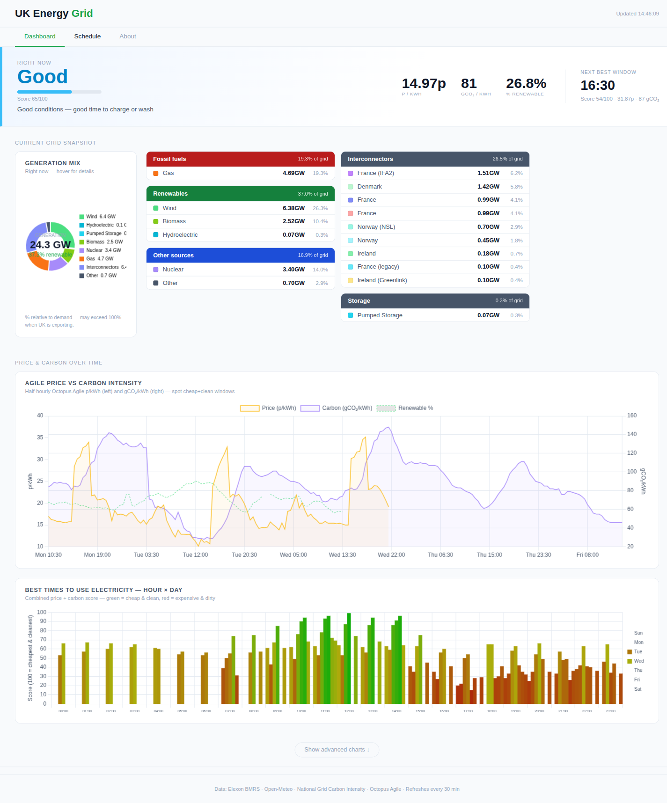
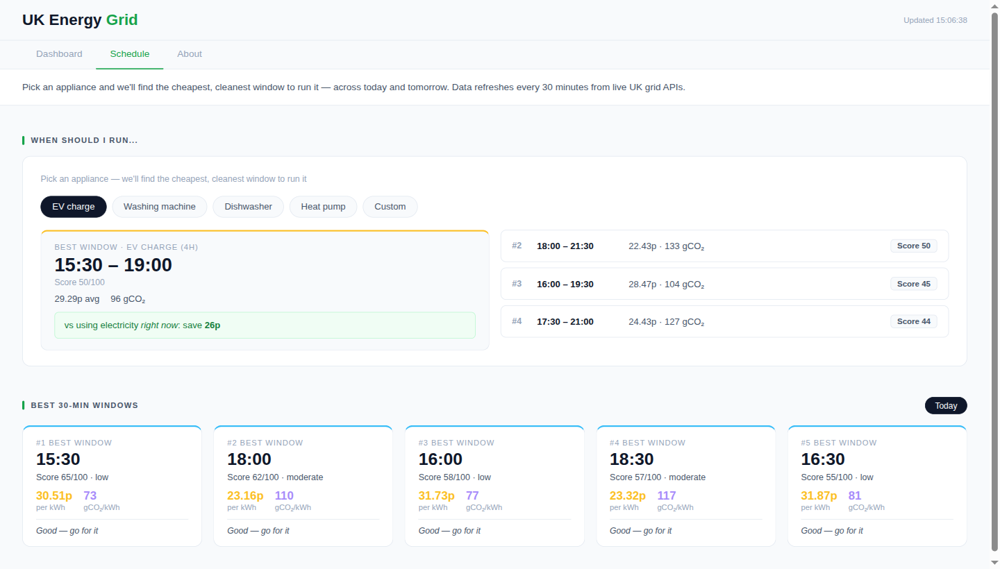
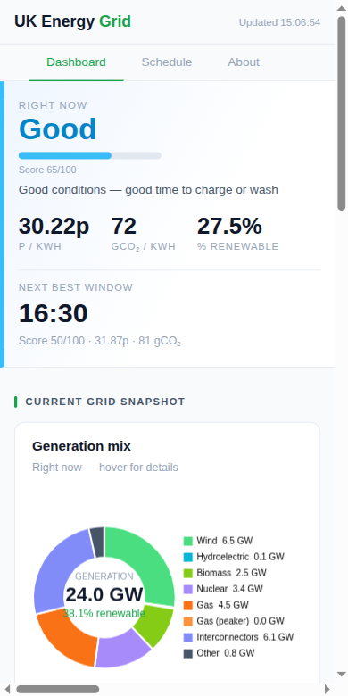

# UK Energy Grid Dashboard

A side project I built for a family friend who recently switched to Octopus Agile. Prices change every 30 minutes on Agile and they kept asking me when the best time was to charge their EV or run the dishwasher — so I figured I'd just build something rather than keep sending screenshots of spreadsheets. Ended up going a bit further than planned.

It pulls live data from four free UK grid APIs, runs it through a small dbt pipeline into DuckDB, and serves it as a FastAPI dashboard. No cloud services, no paid APIs, no database server — just Python and a single file on disk.



---

## What it does

- Shows the current Agile price, carbon intensity, and renewable % — with a simple 0–100 score for "is right now a good time to use electricity" (the main thing my family friend actually looks at)
- Picks the cheapest, cleanest window to run an appliance (EV charge, washing machine, dishwasher, heat pump, or custom)
- Shows the top 5 half-hour slots for today and tomorrow
- Live generation mix — what's actually on the grid right now (wind, gas, nuclear, interconnectors, etc.)
- A bunch of charts: price/carbon over time, hour-of-day heatmap, regional carbon intensity, renewable % trend, solar/wind index, temperature vs demand
- Works on mobile





---

## Stack

| | |
|-|-|
| Backend | FastAPI + uvicorn (Python 3.12) |
| Database | DuckDB — single file, no server needed |
| Pipeline | dbt-core + dbt-duckdb |
| Frontend | Vanilla JS + Chart.js, plain HTML — no build step |

Deliberately kept it simple — my family friend just needs it to work in a browser, not require a degree to run.

---

## Running it locally

You'll need Python 3.12+ and pip. Everything else is installed automatically.

```bash
git clone https://github.com/YOUR_USERNAME/uk-energy-grid.git
cd uk-energy-grid
pip install -r requirements.txt --break-system-packages
```

Then pull the data for the first time:

```bash
bash run_pipeline.sh
```

This hits the four APIs and builds `energy.duckdb` from scratch. Takes about 10–20 seconds.

Then start the app:

```bash
python3 dashboard/app.py
# → http://localhost:8000
```

Or with auto-reload if you're poking around:

```bash
python3 -m uvicorn dashboard.app:app --host 0.0.0.0 --port 8000 --reload
```

To keep the data fresh, run the pipeline on a cron every 30 minutes:

```
*/30 * * * * cd /path/to/uk-energy-grid && bash run_pipeline.sh
```

---

## Environment variables

There's only one and it's optional:

| Variable | Default | What it does |
|----------|---------|---------|
| `ENERGY_DB_PATH` | `./energy.duckdb` | Where to put the database file |

---

## Data sources

All free, no sign-up required:

| Source | What I use it for |
|--------|-------------------|
| [Elexon BMRS](https://bmrs.elexon.co.uk/) | Half-hourly generation by fuel type |
| [Open-Meteo](https://open-meteo.com/) | Weather in Birmingham — solar, wind, temperature |
| [Carbon Intensity API](https://carbonintensity.org.uk/) | National + regional carbon intensity, 48h forecast |
| [Octopus Energy API](https://developer.octopus.energy/) | Agile half-hourly prices, 48h ahead |

---

## How the pipeline works

Data flows through three dbt layers into DuckDB:

```
bronze → raw API responses as views (no changes)
silver → type-cast, deduplicated
gold   → joined, aggregated mart tables that the API queries directly
```

The "window score" used to rank time slots:

```
price_rank  = percent_rank() OVER (ORDER BY price ASC)
carbon_rank = percent_rank() OVER (ORDER BY carbon ASC)
score       = (price_rank + carbon_rank) / 2 × 100
```

100 = cheapest and cleanest available. 0 = avoid. My family friend just looks at the colour and the number — which is kind of the point.

---

## Project layout

```
├── dashboard/
│   ├── app.py          ← FastAPI app, all the API endpoints
│   └── templates/
│       └── index.html  ← the whole frontend (vanilla JS, Chart.js)
├── ingest/
│   └── fetch_all.py    ← hits the 4 APIs, writes to bronze tables
├── models/
│   ├── bronze/         ← raw views
│   ├── silver/         ← cleaned models
│   └── gold/           ← mart tables the app queries
├── seeds/
│   └── region_lookup.csv
├── run_pipeline.sh     ← ingest + dbt run, called by cron
├── requirements.txt
└── dbt_project.yml
```

---

## API endpoints

All public, no auth:

| Path | Returns |
|------|---------|
| `/api/now` | Current price, carbon, renewable %, score, next best window |
| `/api/windows-by-day` | Top 5 windows for today + tomorrow |
| `/api/appliance-windows?hours=X` | Best windows for an X-hour block |
| `/api/prices-carbon` | Last 200 half-hourly price + carbon rows |
| `/api/combined-heatmap` | Price+carbon score by hour × day-of-week |
| `/api/best-windows` | Top 10 future windows |
| `/api/fuel-mix` | Last 48h generation by fuel type |
| `/api/renewable-mix` | Last 30 days renewable % + weather |
| `/api/regional-carbon` | Current carbon by UK region |
| `/api/solar-weather` | Solar/wind index |
| `/api/temp-vs-demand` | Temperature vs grid demand |
| `/api/demand-profile` | Avg demand by hour, weekday vs weekend |
| `/api/grid-stress` | Last 7 days high-carbon events |
| `/api/interconnectors` | Last 48h interconnector flows |
| `/api/kpi` | Summary KPIs |

---

## Deploying it

It's just a Python process and a file — runs fine on any VPS or a cheap cloud instance.

For Railway / Fly.io / Render:
1. Push to GitHub and connect the repo
2. Start command: `python3 -m uvicorn dashboard.app:app --host 0.0.0.0 --port 8000`
3. Add a cron job for the pipeline (`bash run_pipeline.sh` every 30 min)
4. If the filesystem is ephemeral, mount a volume and point `ENERGY_DB_PATH` at it

For a VPS with systemd:

```ini
# /etc/systemd/system/ukenergy.service
[Unit]
Description=UK Energy Grid Dashboard
After=network.target

[Service]
WorkingDirectory=/opt/uk-energy-grid
ExecStart=python3 -m uvicorn dashboard.app:app --host 0.0.0.0 --port 8000
Restart=always
Environment=ENERGY_DB_PATH=/opt/uk-energy-grid/energy.duckdb

[Install]
WantedBy=multi-user.target
```

---

## Common issues

**Nothing showing on the dashboard**

Run `bash run_pipeline.sh` and see if it errors. Usually it's a flaky API — just run it again.

**`energy.duckdb` not found**

You need to run the pipeline at least once before starting the app. It creates the database file.

**dbt command not found in cron**

dbt ends up in `~/.local/bin/` which cron doesn't see. The pipeline script hardcodes the path — update it if yours is different:
```bash
which dbt
```

**Port 8000 already in use**

```bash
lsof -i :8000 && kill -9 <PID>
```

---

## Attribution

- Elexon BMRS data © Elexon Ltd
- Carbon Intensity API — National Grid ESO / University of Oxford / WWF
- Open-Meteo — CC BY 4.0
- Octopus Energy API — Octopus Energy Ltd
